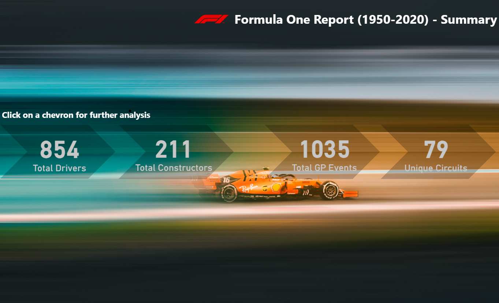
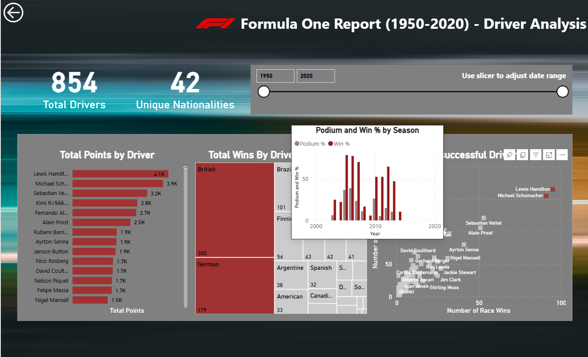
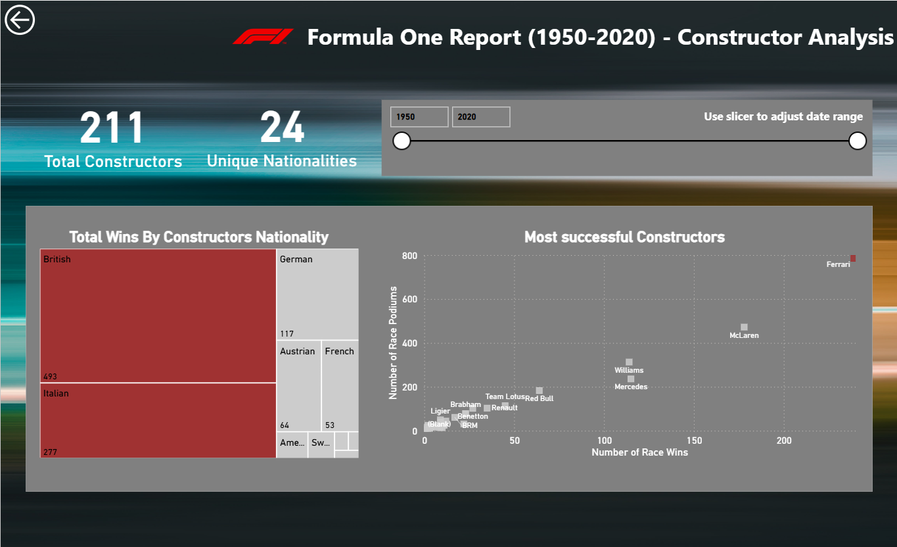
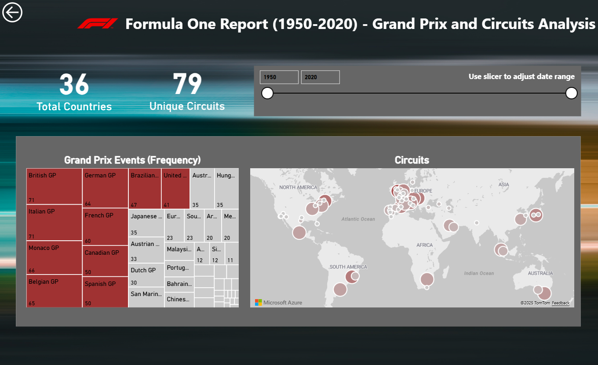

# 🏎️ Formula 1 Power BI Report (1950–2020)

## 📘 Context
This Power BI project analyzes Formula 1 data from 1950 to 2020, offering a historical perspective on the sport's evolution. It highlights legendary drivers, dominant constructors, and iconic circuits through interactive visualizations. The report is designed for fans, analysts, and data enthusiasts seeking insights across decades of racing.

---

## 🎥 Preview

  <table>
    <tr>
      <td align="center">
        
      </td>
      <td align="center">
        
      </td>
    </tr>
    <tr>
      <td align="center">
        
      </td>
      <td align="center">
        
      </td>
    </tr>
  </table>

---

## 🔗 Data Sources and Processing
Data was compiled from publicly available historical Formula 1 datasets.  
The data was cleaned, transformed, and structured using **Power Query** within Power BI.  
Relationships were established between tables to enable dynamic filtering and interactive analysis.

**Included data files:**
- `circuits.json`: Circuit metadata  
- `constructors.csv`: Constructor details  
- `drivers.txt`: Driver profiles  
- `races.csv`: Race calendar  
- `results.csv`: Race outcomes  

---

## 🧠 Data Model

<table>
  <tr>
    <td valign="top">

### 🏎️ Drivers
- `driver_id`  
- `driver_name`  
- `driver_nationality`

   </td>
    <td valign="top">

### 🏗️ Constructors
- `constructor_id`  
- `constructor_name`  
- `constructor_nationality`

   </td>
    <td valign="top">

### 🏁 Results
- `result_id`  
- `race_id`  
- `driver_id`  
- `constructor_id`  
- `finish_position`  

   </td>
  </tr>
  <tr>
    <td valign="top">

### 🏟️ Circuits
- `circuit_id`  
- `circuit_name`  
- `country`

   </td>
    <td valign="top">

### 🗓️ Races
- `race_id`  
- `circuit_id`  
- `grand_prix`  
- `year`

   </td>
    <td valign="top">

### 🔗 Relationships
- Drivers ↔ Results  
- Constructors ↔ Results  
- Circuits ↔ Races ↔ Results  

   </td>
  </tr>
</table>

---

## 🛠️ Custom Columns and Measures

### 🥉 race_podium Indicates whether a driver finished in the top 3 positions. 
- 1: Driver finished 1st, 2nd, or 3rd (podium finish)
- 0: Driver finished outside the top 3
Used to analyze podium consistency across drivers, constructors over seasons. 

### 🏆 race_wins Flags whether a driver won the race. 
- 1: Driver won the race
- 0: Driver did not win
Helps track total wins and identify dominant drivers or teams over time.

### 🧮 `total_points_adjusted`
Normalizes race points across seasons using a consistent scoring system based on the modern Formula 1 format.  
This allows fair comparisons across eras with different point systems.

| **Finish Position** | **total_points_adjusted** |
|---------------------|---------------------------|
| 1st                 | 25                        |
| 2nd                 | 18                        |
| 3rd                 | 15                        |
| 4th                 | 12                        |
| 5th                 | 10                        |
| 6th                 | 8                         |
| 7th                 | 6                         |
| 8th                 | 4                         |
| 9th                 | 2                         |
| 10th                | 1                         |
| 11th and beyond     | 0                         |

### 📈 `% race_wins`
Calculates the percentage of races won by a driver relative to his total participations.  

### 🏁 `% race_podium`
Measures the percentage of races where a driver finished on the podium (top 3).  

---

## 📊 Report Overview

The report is structured into several interactive pages:

### 🔹 Summary Page
- High-level dashboard with key metrics.
- Navigation chevron to access detailed report sections.

### 🔹 Driver Analysis
- Filter drivers by nationality.
- View win counts and podium finishes.
- Compare performance across seasons.

### 🔹 Constructor Analysis
- Analyze constructor performance by nationality.
- Explore win and podium statistics.
- Identify dominant teams over time.

### 🔹 Grand Prix & Circuit Analysis
- Frequency of Grand Prix events.
- Circuit popularity and usage trends.
- Geographical distribution of races.

---

## 🧭 Usage

1. **Download the report files** from the repository.  
2. **Copy the full path** of the downloaded files.  
3. **Paste the path** into the Power BI parameter field to connect the report to the data source.  
4. **Publish the report** to **Power BI Service (Microsoft Fabric)** for online access and sharing.

---

## 🏆 Achievements

- 🚀 **Developed** a comprehensive Formula 1 analytics report covering data from 1950 to 2020.  
- 📊 **Collected, cleaned, and modeled** multi-source historical datasets to ensure accuracy and consistency.  
- ⚙️ **Designed advanced DAX measures** for podium finishes, race wins, and normalized scoring systems.  
- 🧩 **Built an intuitive Power BI data model** enabling seamless filtering across drivers, constructors, and circuits.  
- 🎨 **Created interactive dashboards** featuring dynamic visuals, drill-throughs, and tooltips for deeper insights.  
- ☁️ **Published and deployed** the report to **Power BI Service (Microsoft Fabric)** for online collaboration.  
- 📈 **Enabled comparative analysis** of drivers, constructors, and races across seven decades of Formula 1 history.  
- 🧮 **Enhanced analysis** using percentage-based measures (`% race_wins` and `% race_podium`) to reveal performance consistency and winning efficiency.

---

## 📜 License

This project is open-source and distributed under the MIT License.  
Original author: [Malvik Vaghadia](https://github.com/malvik01)

All rights and credits belong to the original creator.  
The MIT License permits use, modification, and distribution, provided the original license and copyright notice are retained
